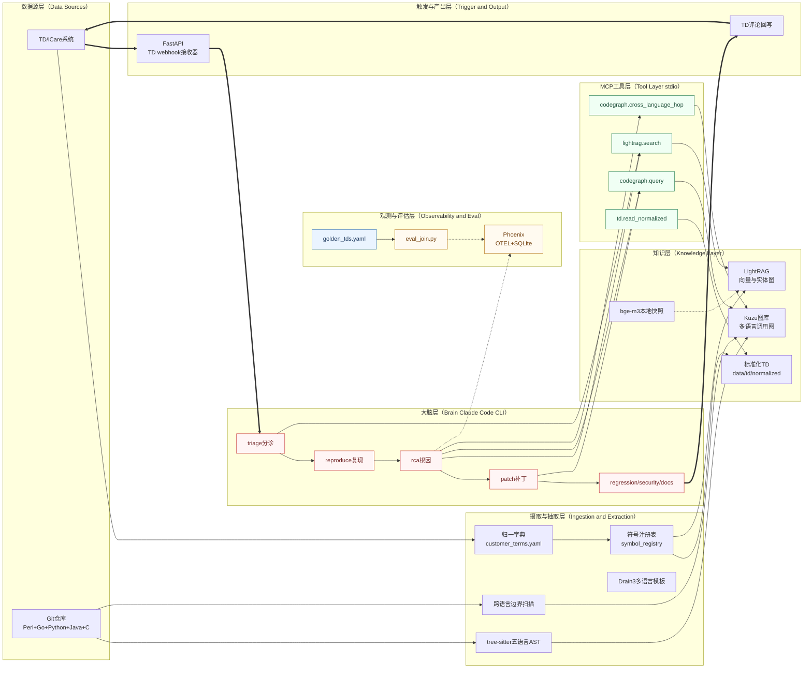

# hci-quality

HCI 质量域知识驱动缺陷闭环系统,中文定位是"把 TD/iCare 的客户缺陷单与 Perl、Go、Python、Java、C 五语言代码仓对齐,由 Claude Code CLI 驱动 subagent 流水线自动完成根因、补丁、回归、安全、文档等工序,并基于 OTEL 轨迹与 golden TD 真值对做可量化的自演进"。

本项目以 `D:\opt-hci-quality\mvp` 为运行根目录,默认环境为 Windows 10、pwsh 7.6.0、python 3.13.12、node 22.22.1、Git Bash 可用、内网 PyPI 与 npm 镜像已配置、无 Docker、无嵌套虚拟化、无容器隔离。

---

## 一、基本立场

- 大脑与手合一。Claude Code 自身的 subagent 机制同时承担编排与执行,不叠加第二层 agent 框架。
- 知识层先行。宁可晚一周接通全链路,也不让劣质知识层污染下游 subagent 的判断。
- 轨迹即真理。任何"变聪明"都必须翻译为 Phoenix 中可见的 span 与 eval_join 的 hit@k、MRR 数字。
- 多语言即头等问题。符号注册表(Symbol Registry)取代手工归一字典,跨语言边类型按 N×M 规划。
- 让步必须配对补救。所有一阶段简化决策在 docs/adr 与 docs/roadmap.md 中锚定二阶段补救动作。

---

## 二、系统总览

系统由七层组成,自底向上为数据源层、摄取抽取层、知识层、工具层、大脑层、触发产出层、观测评估层。下图按左至右勾勒一次端到端调用的走向。



---

## 三、目录总览

```text
D:\opt-hci-quality\mvp\
├── README.md                     本文件
├── pyproject.toml                Python项目定义,Poetry与uv双兼容
├── .mcp.json                     Claude Code MCP工具注册
├── config.toml                   OpenHands占位,二阶段启用
├── .env.example                  环境变量模板
├── .claude/
│   ├── agents/                   七个subagent
│   └── commands/                 斜杠命令
├── docs/
│   ├── architecture.md           总体架构参照
│   ├── roadmap.md                Phase01至Phase10
│   ├── mvp-bootstrap.md          claude -p可消费的操作清单
│   ├── operations.md             日常运维
│   ├── references.md             参考资料与引注
│   └── adr/                      架构决策记录
├── src/hci_quality/
│   ├── ingest/                   TD归一,Drain3,堆栈抽取,LightRAG适配
│   ├── graph/                    tree-sitter,Kuzu,跨语言边界
│   ├── lang_bridge/              多语言符号注册表与扩展
│   ├── mcp/                      三个MCP stdio server
│   ├── webhook/                  TD事件接收器与评论回写
│   ├── eval/                     golden TD挖掘与离线评估
│   ├── obs/                      Phoenix OTEL引导
│   └── utils/                    通用工具
├── configs/
│   ├── customer_terms.yaml
│   ├── golden_tds.yaml
│   ├── module_owners.yaml
│   └── logging.yaml
├── scripts/                      PowerShell入口
├── tests/
│   ├── unit/
│   └── integration/
├── data/
│   ├── td/raw
│   ├── td/normalized
│   ├── td/tasks
│   └── templates
├── models/bge-m3/                HuggingFace快照
├── repos/                        被分析的多语言源码工作树
├── logs/
└── traces/                       Phoenix SQLite后端
```

---

## 四、一键起步

### 4.1 用 Claude CLI 驱动

```text
cd D:\opt-hci-quality\mvp
claude -p "按 docs/mvp-bootstrap.md 从 Action-1.1 开始顺序执行,每完成一个 Action 都按该文档的正确预期、错误预期、排错指引做一次自检。验收失败立刻停止并输出排错建议,不要跳过。"
```

### 4.2 人工分步启动

```text
pwsh -File scripts\create_scaffold.ps1
pwsh -File scripts\02_verify_env.ps1
pwsh -File scripts\01_bootstrap_env.ps1
pwsh -File scripts\03_ingest_td.ps1
pwsh -File scripts\04_build_codegraph.ps1
pwsh -File scripts\05_start_phoenix.ps1
pwsh -File scripts\06_start_webhook.ps1
pwsh -File scripts\07_run_eval.ps1
pwsh -File scripts\99_e2e_smoke.ps1
```

---

## 五、文档入口

| 文档 | 面向读者 | 用途 |
| --- | --- | --- |
| docs/architecture.md | 架构师、新入组工程师 | 分层、数据流、接口契约 |
| docs/roadmap.md | PM、Tech Lead | Phase01 至 Phase10 的节奏 |
| docs/mvp-bootstrap.md | 实施工程师、Claude CLI | 可执行动作与验收判据 |
| docs/operations.md | 运维 | 守护、故障定位、升级 |
| docs/adr/ | 架构评审者 | 关键决策归档 |
| docs/references.md | 所有人 | 外部资料与引注 |

---

## 六、许可证与维护

Apache-2.0。
